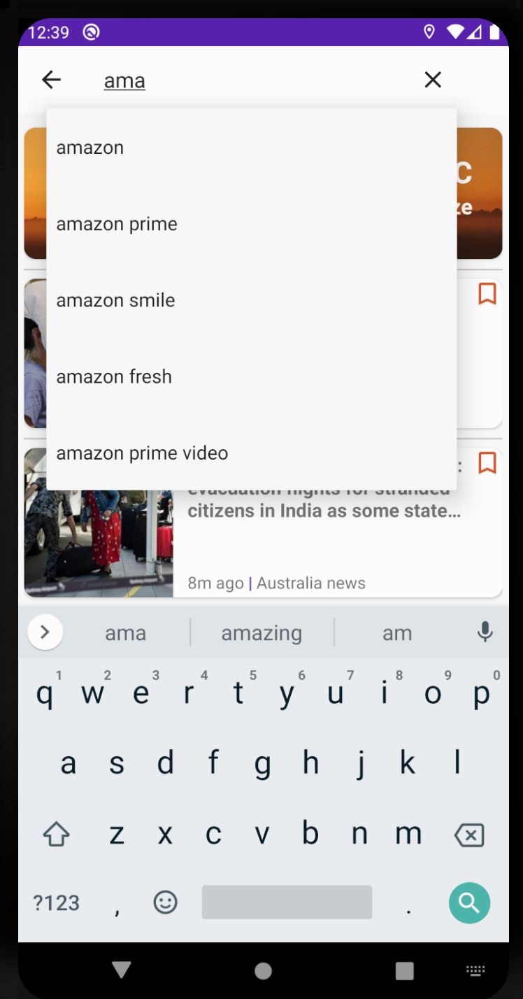
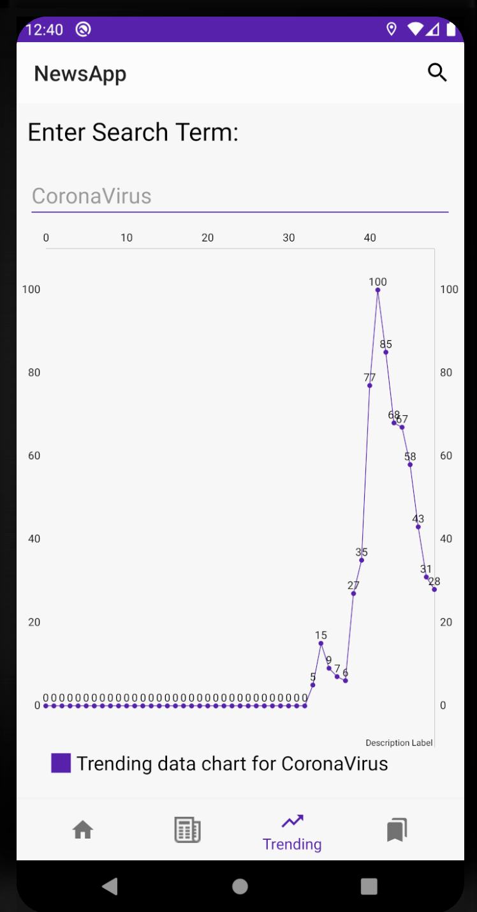

<h2>Get node_backend from <a href="https://github.com/Raj1998/news-app-react-node">this</a> repo </h2>

# Screenshots

<table>
<tr>
    <td>
        
    </td>
    <td>
        
    </td>
</tr>
<tr>
    <td>
        
    </td>
    <td>
        
    </td>
</tr>
<tr>
    <td>
        
    </td>
    <td>
        
    </td>
</tr>
<tr>
    <td>
        
    </td>
    <td>
        
    </td>
</tr>

</table>